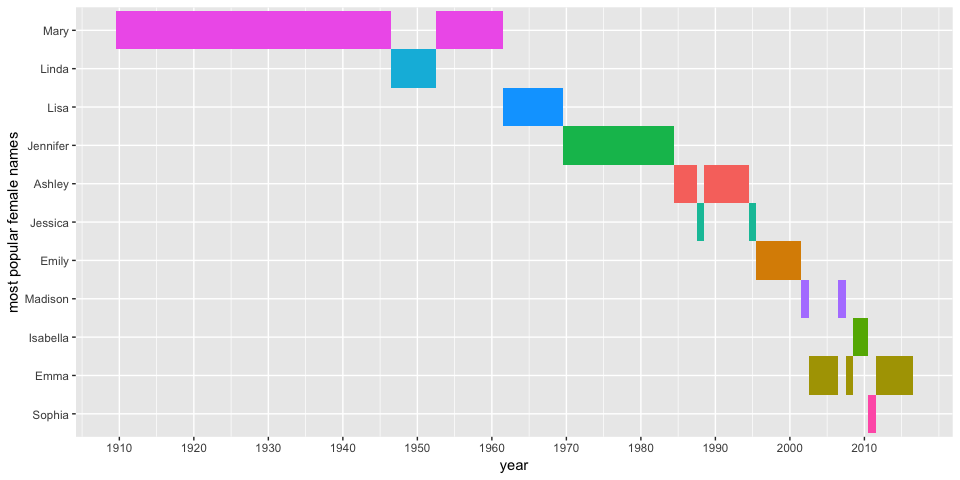
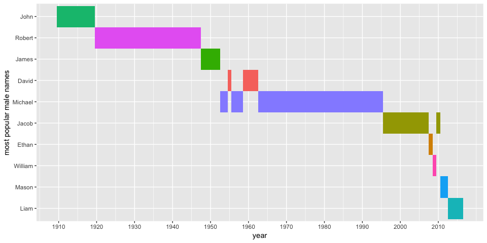

2018/1/23

> -   unzip a folder containing a list of split data files
> -   read and merge individual files into one single data frame
> -   some exploratory analysis and visualizations

data used: [Baby Names from Social Security Card Applications](https://catalog.data.gov/dataset/baby-names-from-social-security-card-applications-data-by-state-and-district-of-)

code reference: [HERE](https://stat.ethz.ch/pipermail/r-help/2010-October/255593.html) [HERE](https://stackoverflow.com/a/35236167)

------------------------------------------------------------------------

``` r
library (tidyverse); library (knitr); library (kableExtra) # Load the package
```

### Take a look at the folder containing the zip file

``` r
list.files ("../data")
## [1] "lipid_1.csv"      "lipid_2.csv"      "lipid.xlsx"      
## [4] "namesbystate"     "namesbystate.zip"
```

### Extract files from a zip archive and place them in a new folder

``` r
path <- "../data/namesbystate/" 
unzip (zipfile = "./data/namesbystate.zip", # file to unzip
       exdir = path) # folder to deposit the files
## Warning in unzip(zipfile = "./data/namesbystate.zip", exdir = path): error
## 1 in extracting from zip file
```

### Now take a look at the folders

``` r
list.files ("../data")
## [1] "lipid_1.csv"      "lipid_2.csv"      "lipid.xlsx"      
## [4] "namesbystate"     "namesbystate.zip"
list.files (path) # the one we just created
##  [1] "AK.TXT"          "AL.TXT"          "AR.TXT"         
##  [4] "AZ.TXT"          "CA.TXT"          "CO.TXT"         
##  [7] "CT.TXT"          "DC.TXT"          "DE.TXT"         
## [10] "FL.TXT"          "GA.TXT"          "HI.TXT"         
## [13] "IA.TXT"          "ID.TXT"          "IL.TXT"         
## [16] "IN.TXT"          "KS.TXT"          "KY.TXT"         
## [19] "LA.TXT"          "MA.TXT"          "MD.TXT"         
## [22] "ME.TXT"          "MI.TXT"          "MN.TXT"         
## [25] "MO.TXT"          "MS.TXT"          "MT.TXT"         
## [28] "NC.TXT"          "ND.TXT"          "NE.TXT"         
## [31] "NH.TXT"          "NJ.TXT"          "NM.TXT"         
## [34] "NV.TXT"          "NY.TXT"          "OH.TXT"         
## [37] "OK.TXT"          "OR.TXT"          "PA.TXT"         
## [40] "RI.TXT"          "SC.TXT"          "SD.TXT"         
## [43] "StateReadMe.pdf" "TN.TXT"          "TX.TXT"         
## [46] "UT.TXT"          "VA.TXT"          "VT.TXT"         
## [49] "WA.TXT"          "WI.TXT"          "WV.TXT"         
## [52] "WY.TXT"
```

Note that the files are separated by states, and there is one pdf file in the folder, which we don't want

### Files are ready. Prepare to read the files.

``` r
files <- paste0 (path, list.files (path)) # produce a path for each file
files <- files [grep ("*TXT", files)] # Keep only the text files we want
head (read.table (files [1], sep = ",")) # without header
##   V1 V2   V3       V4 V5
## 1 AK  F 1910     Mary 14
## 2 AK  F 1910    Annie 12
## 3 AK  F 1910     Anna 10
## 4 AK  F 1910 Margaret  8
## 5 AK  F 1910    Helen  7
## 6 AK  F 1910    Elsie  6
```

### Read through the file list and merge into one single data frame

``` r
df <- do.call ("rbind", 
               lapply (files, read.table, sep = ",")) %>% 
  # rbindlist (lapply (files, read.table, sep = ",")) 
  # works as well
  as_tibble %>% # turn the table into tbl_df
  print
## # A tibble: 5,838,786 x 5
##    V1    V2       V3 V4          V5
##    <fct> <fct> <int> <fct>    <int>
##  1 AK    F      1910 Mary        14
##  2 AK    F      1910 Annie       12
##  3 AK    F      1910 Anna        10
##  4 AK    F      1910 Margaret     8
##  5 AK    F      1910 Helen        7
##  6 AK    F      1910 Elsie        6
##  7 AK    F      1910 Lucy         6
##  8 AK    F      1910 Dorothy      5
##  9 AK    F      1911 Mary        12
## 10 AK    F      1911 Margaret     7
## # … with 5,838,776 more rows

table (df$V1) # check if all states are in
## 
##     AK     AL     AR     AZ     CA     CO     CT     DC     DE     FL 
##  27624 130297  98853 110866 367931 103360  79191  54535  31364 196277 
##     GA     HI     IA     ID     IL     IN     KS     KY     LA     MA 
## 175283  53313  90838  55931 221429 134017  91133 114630 144158 114436 
##     MD     ME     MI     MN     MO     MS     MT     NC     ND     NE 
## 106832  49252 176384 109746 133599 110969  44609 166640  44965  69643 
##     NH     NJ     NM     NV     NY     OH     OK     OR     PA     RI 
##  38009 147110  73503  44745 287096 188412 113255  85202 191694  39262 
##     SC     SD     TN     TX     UT     VA     VT     WA     WI     WV 
## 114134  46118 135188 337176  85818 141687  28269 119050 112073  75362 
##     WY 
##  27518
 
header <- c ("state", "sex", "year", "name", "occurrence") # column names
names (df) <- header
df 
## # A tibble: 5,838,786 x 5
##    state sex    year name     occurrence
##    <fct> <fct> <int> <fct>         <int>
##  1 AK    F      1910 Mary             14
##  2 AK    F      1910 Annie            12
##  3 AK    F      1910 Anna             10
##  4 AK    F      1910 Margaret          8
##  5 AK    F      1910 Helen             7
##  6 AK    F      1910 Elsie             6
##  7 AK    F      1910 Lucy              6
##  8 AK    F      1910 Dorothy           5
##  9 AK    F      1911 Mary             12
## 10 AK    F      1911 Margaret          7
## # … with 5,838,776 more rows
```

### Some exploratory analysis

``` r
popular_names <- df %>% 
  group_by (state, sex, year) %>% 
  filter (occurrence == max (occurrence)) %>% 
  group_by (sex, year) %>% 
  summarize (name = names (which.max (table (name))))
  # get the most popular name of the year
  
popular_names %>% # print table
  spread (sex, name) %>% 
  kable (format = "markdown") %>% 
  print
## 
## 
## | year|F        |M       |
## |----:|:--------|:-------|
## | 1910|Mary     |John    |
## | 1911|Mary     |John    |
## | 1912|Mary     |John    |
## | 1913|Mary     |John    |
## | 1914|Mary     |John    |
## | 1915|Mary     |John    |
## | 1916|Mary     |John    |
## | 1917|Mary     |John    |
## | 1918|Mary     |John    |
## | 1919|Mary     |John    |
## | 1920|Mary     |Robert  |
## | 1921|Mary     |Robert  |
## | 1922|Mary     |Robert  |
## | 1923|Mary     |Robert  |
## | 1924|Mary     |Robert  |
## | 1925|Mary     |Robert  |
## | 1926|Mary     |Robert  |
## | 1927|Mary     |Robert  |
## | 1928|Mary     |Robert  |
## | 1929|Mary     |Robert  |
## | 1930|Mary     |Robert  |
## | 1931|Mary     |Robert  |
## | 1932|Mary     |Robert  |
## | 1933|Mary     |Robert  |
## | 1934|Mary     |Robert  |
## | 1935|Mary     |Robert  |
## | 1936|Mary     |Robert  |
## | 1937|Mary     |Robert  |
## | 1938|Mary     |Robert  |
## | 1939|Mary     |Robert  |
## | 1940|Mary     |Robert  |
## | 1941|Mary     |Robert  |
## | 1942|Mary     |Robert  |
## | 1943|Mary     |Robert  |
## | 1944|Mary     |Robert  |
## | 1945|Mary     |Robert  |
## | 1946|Mary     |Robert  |
## | 1947|Linda    |Robert  |
## | 1948|Linda    |James   |
## | 1949|Linda    |James   |
## | 1950|Linda    |James   |
## | 1951|Linda    |James   |
## | 1952|Linda    |James   |
## | 1953|Mary     |Michael |
## | 1954|Mary     |Michael |
## | 1955|Mary     |David   |
## | 1956|Mary     |Michael |
## | 1957|Mary     |Michael |
## | 1958|Mary     |Michael |
## | 1959|Mary     |David   |
## | 1960|Mary     |David   |
## | 1961|Mary     |David   |
## | 1962|Lisa     |David   |
## | 1963|Lisa     |Michael |
## | 1964|Lisa     |Michael |
## | 1965|Lisa     |Michael |
## | 1966|Lisa     |Michael |
## | 1967|Lisa     |Michael |
## | 1968|Lisa     |Michael |
## | 1969|Lisa     |Michael |
## | 1970|Jennifer |Michael |
## | 1971|Jennifer |Michael |
## | 1972|Jennifer |Michael |
## | 1973|Jennifer |Michael |
## | 1974|Jennifer |Michael |
## | 1975|Jennifer |Michael |
## | 1976|Jennifer |Michael |
## | 1977|Jennifer |Michael |
## | 1978|Jennifer |Michael |
## | 1979|Jennifer |Michael |
## | 1980|Jennifer |Michael |
## | 1981|Jennifer |Michael |
## | 1982|Jennifer |Michael |
## | 1983|Jennifer |Michael |
## | 1984|Jennifer |Michael |
## | 1985|Ashley   |Michael |
## | 1986|Ashley   |Michael |
## | 1987|Ashley   |Michael |
## | 1988|Jessica  |Michael |
## | 1989|Ashley   |Michael |
## | 1990|Ashley   |Michael |
## | 1991|Ashley   |Michael |
## | 1992|Ashley   |Michael |
## | 1993|Ashley   |Michael |
## | 1994|Ashley   |Michael |
## | 1995|Jessica  |Michael |
## | 1996|Emily    |Jacob   |
## | 1997|Emily    |Jacob   |
## | 1998|Emily    |Jacob   |
## | 1999|Emily    |Jacob   |
## | 2000|Emily    |Jacob   |
## | 2001|Emily    |Jacob   |
## | 2002|Madison  |Jacob   |
## | 2003|Emma     |Jacob   |
## | 2004|Emma     |Jacob   |
## | 2005|Emma     |Jacob   |
## | 2006|Emma     |Jacob   |
## | 2007|Madison  |Jacob   |
## | 2008|Emma     |Ethan   |
## | 2009|Isabella |William |
## | 2010|Isabella |Jacob   |
## | 2011|Sophia   |Mason   |
## | 2012|Emma     |Mason   |
## | 2013|Emma     |Liam    |
## | 2014|Emma     |Liam    |
## | 2015|Emma     |Liam    |
## | 2016|Emma     |Liam    |
```

### Use heatmap concept in ggplot2 to show time series changes

``` r
library (ggplot2)
ggplot (popular_names %>% filter (sex == "F"), 
       aes (x = year, y = reorder (name, -year), fill = name)) + 
  # reorder names according to their order of appearance (ascending year)
  # specify colors by names
  geom_tile () +
  labs (y = "most popular female names") +
  scale_x_continuous (breaks = seq (min (popular_names$year), max (popular_names$year), by = 10)) +
  theme (legend.position = "none") # remove legend
```



``` r

ggplot (popular_names %>% filter (sex == "M"), 
       aes (x = year, y = reorder (name, -year), fill = name)) +
  geom_tile () +
  labs (y = "most popular male names") +
    scale_x_continuous (breaks = seq (min (popular_names$year), max (popular_names$year), by = 10)) +
  theme (legend.position = "none")
```


