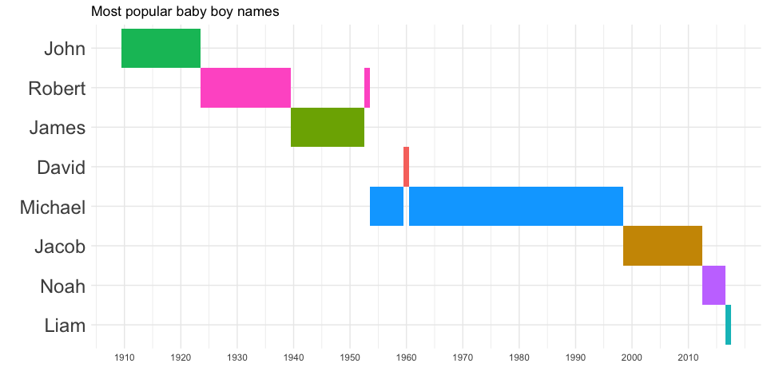

2018/1/23

> -   unzip a folder containing a list of split data files
> -   read and merge individual files into one single data frame
> -   some exploratory analysis and visualizations

data used: [Baby Names from Social Security Card Applications](https://catalog.data.gov/dataset/baby-names-from-social-security-card-applications-data-by-state-and-district-of-)

code reference: [HERE](https://stat.ethz.ch/pipermail/r-help/2010-October/255593.html) [HERE](https://stackoverflow.com/a/35236167)

------------------------------------------------------------------------

``` r
library (tidyverse); library (knitr); library (kableExtra) # Load the package
```

### Take a look at the folder containing the zip file

``` r
list.files ("../data")
## [1] "lipid_1.csv"      "lipid_2.csv"      "lipid.xlsx"      
## [4] "namesbystate"     "namesbystate.zip"
```

### Extract files from a zip archive and place them in a new folder

``` r
path <- "../data/namesbystate/" 
unzip (zipfile = "./data/namesbystate.zip", # file to unzip
       exdir = path) # folder to deposit the files
## Warning in unzip(zipfile = "./data/namesbystate.zip", exdir = path): error
## 1 in extracting from zip file
```

### Now take a look at the folders

``` r
list.files ("../data")
## [1] "lipid_1.csv"      "lipid_2.csv"      "lipid.xlsx"      
## [4] "namesbystate"     "namesbystate.zip"
list.files (path) # the one we just created
##  [1] "AK.TXT"          "AL.TXT"          "AR.TXT"         
##  [4] "AZ.TXT"          "CA.TXT"          "CO.TXT"         
##  [7] "CT.TXT"          "DC.TXT"          "DE.TXT"         
## [10] "FL.TXT"          "GA.TXT"          "HI.TXT"         
## [13] "IA.TXT"          "ID.TXT"          "IL.TXT"         
## [16] "IN.TXT"          "KS.TXT"          "KY.TXT"         
## [19] "LA.TXT"          "MA.TXT"          "MD.TXT"         
## [22] "ME.TXT"          "MI.TXT"          "MN.TXT"         
## [25] "MO.TXT"          "MS.TXT"          "MT.TXT"         
## [28] "NC.TXT"          "ND.TXT"          "NE.TXT"         
## [31] "NH.TXT"          "NJ.TXT"          "NM.TXT"         
## [34] "NV.TXT"          "NY.TXT"          "OH.TXT"         
## [37] "OK.TXT"          "OR.TXT"          "PA.TXT"         
## [40] "RI.TXT"          "SC.TXT"          "SD.TXT"         
## [43] "StateReadMe.pdf" "TN.TXT"          "TX.TXT"         
## [46] "UT.TXT"          "VA.TXT"          "VT.TXT"         
## [49] "WA.TXT"          "WI.TXT"          "WV.TXT"         
## [52] "WY.TXT"
```

Note that the files are separated by states, and there is one pdf file in the folder, which we don't want

### Files are ready. Prepare to read the files.

``` r
files <- paste0 (path, list.files (path)) # produce a path for each file
files <- files [grep ("*TXT", files)] # Keep only the text files we want
head (read.table (files [1], sep = ",")) # without header
##   V1 V2   V3       V4 V5
## 1 AK  F 1910     Mary 14
## 2 AK  F 1910    Annie 12
## 3 AK  F 1910     Anna 10
## 4 AK  F 1910 Margaret  8
## 5 AK  F 1910    Helen  7
## 6 AK  F 1910    Elsie  6
```

### Read through the file list and merge into one single data frame

``` r
df <- do.call ("rbind", 
               lapply (files, read.table, sep = ",")) %>% 
  # rbindlist (lapply (files, read.table, sep = ",")) 
  # works as well
  as_tibble %>% # turn the table into tibble
  print
## # A tibble: 5,838,786 x 5
##    V1    V2       V3 V4          V5
##    <fct> <fct> <int> <fct>    <int>
##  1 AK    F      1910 Mary        14
##  2 AK    F      1910 Annie       12
##  3 AK    F      1910 Anna        10
##  4 AK    F      1910 Margaret     8
##  5 AK    F      1910 Helen        7
##  6 AK    F      1910 Elsie        6
##  7 AK    F      1910 Lucy         6
##  8 AK    F      1910 Dorothy      5
##  9 AK    F      1911 Mary        12
## 10 AK    F      1911 Margaret     7
## # … with 5,838,776 more rows

table (df$V1) # check if all states are in
## 
##     AK     AL     AR     AZ     CA     CO     CT     DC     DE     FL 
##  27624 130297  98853 110866 367931 103360  79191  54535  31364 196277 
##     GA     HI     IA     ID     IL     IN     KS     KY     LA     MA 
## 175283  53313  90838  55931 221429 134017  91133 114630 144158 114436 
##     MD     ME     MI     MN     MO     MS     MT     NC     ND     NE 
## 106832  49252 176384 109746 133599 110969  44609 166640  44965  69643 
##     NH     NJ     NM     NV     NY     OH     OK     OR     PA     RI 
##  38009 147110  73503  44745 287096 188412 113255  85202 191694  39262 
##     SC     SD     TN     TX     UT     VA     VT     WA     WI     WV 
## 114134  46118 135188 337176  85818 141687  28269 119050 112073  75362 
##     WY 
##  27518
 
header <- c ("state", "sex", "year", "name", "occurrence") # column names
names (df) <- header
df 
## # A tibble: 5,838,786 x 5
##    state sex    year name     occurrence
##    <fct> <fct> <int> <fct>         <int>
##  1 AK    F      1910 Mary             14
##  2 AK    F      1910 Annie            12
##  3 AK    F      1910 Anna             10
##  4 AK    F      1910 Margaret          8
##  5 AK    F      1910 Helen             7
##  6 AK    F      1910 Elsie             6
##  7 AK    F      1910 Lucy              6
##  8 AK    F      1910 Dorothy           5
##  9 AK    F      1911 Mary             12
## 10 AK    F      1911 Margaret          7
## # … with 5,838,776 more rows
```

### Some exploratory analysis: what are the most popular names of the years?

``` r
national_count <- df %>% # sum up national count of baby names
  group_by(sex, year, name) %>% 
  summarize (occurrence_all = sum (occurrence)) %>% 
  arrange (sex, year, desc(occurrence_all)) %>% 
  print
## # A tibble: 604,054 x 4
## # Groups:   sex, year [214]
##    sex    year name      occurrence_all
##    <fct> <int> <fct>              <int>
##  1 F      1910 Mary               22848
##  2 F      1910 Helen              10479
##  3 F      1910 Margaret            8222
##  4 F      1910 Dorothy             7314
##  5 F      1910 Ruth                7209
##  6 F      1910 Anna                6433
##  7 F      1910 Elizabeth           5792
##  8 F      1910 Mildred             5690
##  9 F      1910 Marie               4778
## 10 F      1910 Alice               4666
## # … with 604,044 more rows

popular_names <- national_count %>% # look for the most popular names
  filter (occurrence_all == max (occurrence_all)) 
  
popular_names %>% # print table
  spread (sex, name) %>% 
  kable (format = "markdown") %>% 
  print
## 
## 
## | year| occurrence_all|F        |M       |
## |----:|--------------:|:--------|:-------|
## | 1910|          11450|NA       |John    |
## | 1910|          22848|Mary     |NA      |
## | 1911|          13446|NA       |John    |
## | 1911|          24390|Mary     |NA      |
## | 1912|          24587|NA       |John    |
## | 1912|          32304|Mary     |NA      |
## | 1913|          29329|NA       |John    |
## | 1913|          36641|Mary     |NA      |
## | 1914|          37948|NA       |John    |
## | 1914|          45345|Mary     |NA      |
## | 1915|          47577|NA       |John    |
## | 1915|          58187|Mary     |NA      |
## | 1916|          50046|NA       |John    |
## | 1916|          61438|Mary     |NA      |
## | 1917|          51852|NA       |John    |
## | 1917|          64281|Mary     |NA      |
## | 1918|          56559|NA       |John    |
## | 1918|          67368|Mary     |NA      |
## | 1919|          53528|NA       |John    |
## | 1919|          65842|Mary     |NA      |
## | 1920|          56916|NA       |John    |
## | 1920|          70975|Mary     |NA      |
## | 1921|          58222|NA       |John    |
## | 1921|          73983|Mary     |NA      |
## | 1922|          57272|NA       |John    |
## | 1922|          72173|Mary     |NA      |
## | 1923|          57469|NA       |John    |
## | 1923|          71634|Mary     |NA      |
## | 1924|          60801|NA       |Robert  |
## | 1924|          73533|Mary     |NA      |
## | 1925|          60894|NA       |Robert  |
## | 1925|          70596|Mary     |NA      |
## | 1926|          61128|NA       |Robert  |
## | 1926|          67831|Mary     |NA      |
## | 1927|          61668|NA       |Robert  |
## | 1927|          70638|Mary     |NA      |
## | 1928|          60691|NA       |Robert  |
## | 1928|          66863|Mary     |NA      |
## | 1929|          59798|NA       |Robert  |
## | 1929|          63513|Mary     |NA      |
## | 1930|          62151|NA       |Robert  |
## | 1930|          64142|Mary     |NA      |
## | 1931|          60292|Mary     |NA      |
## | 1931|          60502|NA       |Robert  |
## | 1932|          59259|NA       |Robert  |
## | 1932|          59870|Mary     |NA      |
## | 1933|          54209|NA       |Robert  |
## | 1933|          55498|Mary     |NA      |
## | 1934|          55829|NA       |Robert  |
## | 1934|          56925|Mary     |NA      |
## | 1935|          55067|Mary     |NA      |
## | 1935|          56519|NA       |Robert  |
## | 1936|          54368|Mary     |NA      |
## | 1936|          58489|NA       |Robert  |
## | 1937|          55643|Mary     |NA      |
## | 1937|          61824|NA       |Robert  |
## | 1938|          56213|Mary     |NA      |
## | 1938|          62268|NA       |Robert  |
## | 1939|          54904|Mary     |NA      |
## | 1939|          59645|NA       |Robert  |
## | 1940|          56198|Mary     |NA      |
## | 1940|          62474|NA       |James   |
## | 1941|          58039|Mary     |NA      |
## | 1941|          66729|NA       |James   |
## | 1942|          63243|Mary     |NA      |
## | 1942|          77179|NA       |James   |
## | 1943|          66171|Mary     |NA      |
## | 1943|          80256|NA       |James   |
## | 1944|          62464|Mary     |NA      |
## | 1944|          76948|NA       |James   |
## | 1945|          59288|Mary     |NA      |
## | 1945|          74450|NA       |James   |
## | 1946|          67465|Mary     |NA      |
## | 1946|          87425|NA       |James   |
## | 1947|          94762|NA       |James   |
## | 1947|          99685|Linda    |NA      |
## | 1948|          88584|NA       |James   |
## | 1948|          96210|Linda    |NA      |
## | 1949|          86856|NA       |James   |
## | 1949|          91013|Linda    |NA      |
## | 1950|          80439|Linda    |NA      |
## | 1950|          86238|NA       |James   |
## | 1951|          73970|Linda    |NA      |
## | 1951|          87283|NA       |James   |
## | 1952|          67082|Linda    |NA      |
## | 1952|          87061|NA       |James   |
## | 1953|          64366|Mary     |NA      |
## | 1953|          86189|NA       |Robert  |
## | 1954|          68006|Mary     |NA      |
## | 1954|          88525|NA       |Michael |
## | 1955|          63159|Mary     |NA      |
## | 1955|          88301|NA       |Michael |
## | 1956|          61750|Mary     |NA      |
## | 1956|          90620|NA       |Michael |
## | 1957|          61095|Mary     |NA      |
## | 1957|          92716|NA       |Michael |
## | 1958|          55855|Mary     |NA      |
## | 1958|          90512|NA       |Michael |
## | 1959|          54473|Mary     |NA      |
## | 1959|          85262|NA       |Michael |
## | 1960|          51477|Mary     |NA      |
## | 1960|          85940|NA       |David   |
## | 1961|          47667|Mary     |NA      |
## | 1961|          86922|NA       |Michael |
## | 1962|          46081|Lisa     |NA      |
## | 1962|          85042|NA       |Michael |
## | 1963|          56037|Lisa     |NA      |
## | 1963|          83788|NA       |Michael |
## | 1964|          54277|Lisa     |NA      |
## | 1964|          82663|NA       |Michael |
## | 1965|          60267|Lisa     |NA      |
## | 1965|          81042|NA       |Michael |
## | 1966|          56914|Lisa     |NA      |
## | 1966|          79989|NA       |Michael |
## | 1967|          52435|Lisa     |NA      |
## | 1967|          82448|NA       |Michael |
## | 1968|          49536|Lisa     |NA      |
## | 1968|          82017|NA       |Michael |
## | 1969|          45027|Lisa     |NA      |
## | 1969|          85224|NA       |Michael |
## | 1970|          46159|Jennifer |NA      |
## | 1970|          85315|NA       |Michael |
## | 1971|          56783|Jennifer |NA      |
## | 1971|          77598|NA       |Michael |
## | 1972|          63609|Jennifer |NA      |
## | 1972|          71414|NA       |Michael |
## | 1973|          62454|Jennifer |NA      |
## | 1973|          67861|NA       |Michael |
## | 1974|          63117|Jennifer |NA      |
## | 1974|          67585|NA       |Michael |
## | 1975|          58186|Jennifer |NA      |
## | 1975|          68454|NA       |Michael |
## | 1976|          59476|Jennifer |NA      |
## | 1976|          66966|NA       |Michael |
## | 1977|          58964|Jennifer |NA      |
## | 1977|          67615|NA       |Michael |
## | 1978|          56318|Jennifer |NA      |
## | 1978|          67159|NA       |Michael |
## | 1979|          56720|Jennifer |NA      |
## | 1979|          67735|NA       |Michael |
## | 1980|          58379|Jennifer |NA      |
## | 1980|          68680|NA       |Michael |
## | 1981|          57046|Jennifer |NA      |
## | 1981|          68765|NA       |Michael |
## | 1982|          57113|Jennifer |NA      |
## | 1982|          68228|NA       |Michael |
## | 1983|          54339|Jennifer |NA      |
## | 1983|          67993|NA       |Michael |
## | 1984|          50562|Jennifer |NA      |
## | 1984|          67732|NA       |Michael |
## | 1985|          48345|Jessica  |NA      |
## | 1985|          64899|NA       |Michael |
## | 1986|          52668|Jessica  |NA      |
## | 1986|          64202|NA       |Michael |
## | 1987|          55988|Jessica  |NA      |
## | 1987|          63642|NA       |Michael |
## | 1988|          51537|Jessica  |NA      |
## | 1988|          64123|NA       |Michael |
## | 1989|          47882|Jessica  |NA      |
## | 1989|          65381|NA       |Michael |
## | 1990|          46473|Jessica  |NA      |
## | 1990|          65276|NA       |Michael |
## | 1991|          43479|Ashley   |NA      |
## | 1991|          60783|NA       |Michael |
## | 1992|          38453|Ashley   |NA      |
## | 1992|          54387|NA       |Michael |
## | 1993|          34987|Jessica  |NA      |
## | 1993|          49552|NA       |Michael |
## | 1994|          32118|Jessica  |NA      |
## | 1994|          44467|NA       |Michael |
## | 1995|          27934|Jessica  |NA      |
## | 1995|          41403|NA       |Michael |
## | 1996|          25151|Emily    |NA      |
## | 1996|          38364|NA       |Michael |
## | 1997|          25731|Emily    |NA      |
## | 1997|          37548|NA       |Michael |
## | 1998|          26180|Emily    |NA      |
## | 1998|          36614|NA       |Michael |
## | 1999|          26538|Emily    |NA      |
## | 1999|          35352|NA       |Jacob   |
## | 2000|          25953|Emily    |NA      |
## | 2000|          34470|NA       |Jacob   |
## | 2001|          25054|Emily    |NA      |
## | 2001|          32536|NA       |Jacob   |
## | 2002|          24460|Emily    |NA      |
## | 2002|          30563|NA       |Jacob   |
## | 2003|          25688|Emily    |NA      |
## | 2003|          29626|NA       |Jacob   |
## | 2004|          25032|Emily    |NA      |
## | 2004|          27876|NA       |Jacob   |
## | 2005|          23934|Emily    |NA      |
## | 2005|          25826|NA       |Jacob   |
## | 2006|          21398|Emily    |NA      |
## | 2006|          24835|NA       |Jacob   |
## | 2007|          19353|Emily    |NA      |
## | 2007|          24265|NA       |Jacob   |
## | 2008|          18806|Emma     |NA      |
## | 2008|          22587|NA       |Jacob   |
## | 2009|          21162|NA       |Jacob   |
## | 2009|          22289|Isabella |NA      |
## | 2010|          22110|NA       |Jacob   |
## | 2010|          22898|Isabella |NA      |
## | 2011|          20356|NA       |Jacob   |
## | 2011|          21833|Sophia   |NA      |
## | 2012|          19061|NA       |Jacob   |
## | 2012|          22292|Sophia   |NA      |
## | 2013|          18224|NA       |Noah    |
## | 2013|          21193|Sophia   |NA      |
## | 2014|          19263|NA       |Noah    |
## | 2014|          20912|Emma     |NA      |
## | 2015|          19594|NA       |Noah    |
## | 2015|          20415|Emma     |NA      |
## | 2016|          19015|NA       |Noah    |
## | 2016|          19414|Emma     |NA      |
```

### Use heatmap concept in ggplot2 to show time series changes

``` r
library (ggplot2)
ggplot (popular_names %>% filter (sex == "F"), 
       aes (x = year, y = reorder (name, -year), fill = name)) + 
  # reorder names according to their order of appearance (ascending year)
  # specify colors by names
  geom_tile () +
  labs (x = "", y="", title = "Most popular baby girl names") +
  scale_x_continuous (breaks = seq (min (popular_names$year), max (popular_names$year), by = 10)) +
  theme_minimal() +
  theme (legend.position = "none", # remove legend
         axis.text.y = element_text (size = 18))
```


``` r

ggplot (popular_names %>% filter (sex == "M"), 
       aes (x = year, y = reorder (name, -year), fill = name)) +
  geom_tile () +
  labs (x = "", y="", title = "Most popular baby boy names") +
  scale_x_continuous (breaks = seq (min (popular_names$year), max (popular_names$year), by = 10)) +
  theme_minimal() +
  theme (legend.position = "none", # remove legend
         axis.text.y = element_text (size = 18))
```



### Summary:

1.  Over the past century, the most popular female names have changed 10 times, whereas male names changed only 7 times, suggesting parents look for new names more frequently for baby girls than for boys.
2.  After the top position of the list was replaced by a new name, the old favorite names might come back once again in the following years. However, when the top position was replaced for the second time, the old favorites are no longer the favorites.

##### Next questions: what social context caused the short appearance of Ashley and David?
